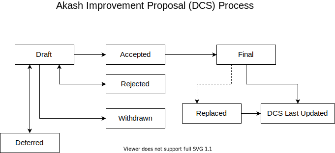

## What is an DCS?

DCS stands for Decentralized Cloud Standard. An DCS is a design document providing information to the Akash community, or describing a new feature for Akash or its processes or environment. The DCS should provide a concise technical specification of the function and a rationale for the feature. The DCS author is responsible for building consensus within the community and documenting dissenting opinions.

## DCS Rationale

We intend DCSs to be the primary mechanisms for proposing new features, for collecting community technical input on an issue, and for documenting the design decisions that have gone into Akash. Because the DCSs are maintained as text files in a versioned repository, their revision history is the historical record of the feature proposal.

For Akash implementers, DCSs are a convenient way to track the progress of their implementation. Ideally, each implementation maintainer would list the DCSs that they have implemented, which end users a convenient way to know the current status of a given implementation or library.

## DCS Types

There are three types of DCS:

- A **Standard Track DCS** describes any change that affects most or all Akash implementations, such as a change to the network protocol, a change in block or transaction validity rules, proposed application standards/conventions, or any change or addition that affects the interoperability of applications using Akash. Furthermore, Standard DCSs can be broken down into the following categories. Standards Track DCSs consist of three parts, a design document, implementation, and finally if warranted an update to the formal specification.
  - **Core** - improvements requiring a consensus fork, as well as changes that are not necessarily consensus critical but may be relevant to "core dev" discussions.
  - **Economics** - includes improvements Akash Economic Model with regards to Staking or Subsidy distribution.
  - **Interface** - includes improvements around client API specifications and standards, and also certain language-level standards like method names. 
- A **Meta DCS** describes a process surrounding Akash or proposes a change to (or an event in) a process. Process DCSs are like Standards Track DCSs but apply to areas other than the Akash protocol itself. They may propose an implementation, but not to Akash's codebase; they often require community consensus; unlike Informational DCSs, they are more than recommendations, and users are typically not free to ignore them. Examples include procedures, guidelines, changes to the decision-making process, and changes to the tools or environment used in Akash development. Any meta-DCS is also considered a Process DCS.
- An **Informational DCS** describes an Akash design issue, or provides general guidelines or information to the DCSs community, but does not propose a new feature. Informational DCSs do not necessarily represent DCSs community consensus or a recommendation, so users and implementers are free to ignore Informational DCSs or follow their advice.

It is highly recommended that a single DCS contain a single key proposal or new idea. The more focused the DCS, the more successful it tends to be. A change to one client doesn't require an DCS; a change that affects multiple clients, or defines a standard for various apps to use, does.

An DCS must meet specific minimum criteria. It must be a clear and complete description of the proposed enhancement. The enhancement must represent a net improvement. The proposed implementation, if applicable, must be robust and must not complicate the protocol unduly.

## DCS Work Flow

### Shepherding an DCS

Parties involved in the process are you, the champion, or *DCS author*, the [*DCS editors*](#dcs-editors), and the *Akash Core Developers*.

Before you begin writing a formal DCS, you should vet your idea. Ask the Akash community first if an idea is original to avoid wasting time on something that will be rejected based on prior research. It is thus recommended to open a discussion in the [Akash Technical Chat].

In addition to making sure your idea is original, it will be your role as the author to make your concept clear to reviewers and interested parties, as well as inviting editors, developers, and community to give feedback on the channels above. You should try and gauge whether the interest in your DCS is commensurate with both the work involved in implementing it and how many parties will have to conform to it. Negative community feedback will be taken into consideration and may prevent your DCS from moving past the Draft stage.

### Core DCSs

For Core DCSs, given that they require client implementations to be considered **Final** (see "DCSs Process" below), you will need to either provide an implementation for clients or convince clients to implement your DCS.

The best way to get client implementers to review your DCS is to present it to the team online at [Akash Technical Chat]. You can request to do so by posting a comment linking your DCS. First, to discuss the technical merits of DCSs. Second, to gauge what other clients will be implementing. Third, to coordinate DCS implementation for network upgrades.

These calls generally result in a "rough consensus" around what DCSs should be implemented. This "rough consensus" rests on the assumptions that DCSs are not contentious enough to cause a network split and that they are technically sound.

### DCS Process



Following is the process that a successful non-Core DCS will move along:

```
[ WIP ] -> [ DRAFT ] -> [ LAST CALL ] -> [ FINAL ]
```

Following is the process that a successful Core DCS will move along:

```
[ IDEA ] -> [ DRAFT ] -> [ LAST CALL ] -> [ ACCEPTED ] -> [ FINAL ]
```

Each status change is requested by the DCS author and reviewed by the DCS editors. Use a pull request to update the status. Please include a link to where people should continue discussing your DCS. The DCS editors will process these requests as per the conditions below.

* **Idea** -- Once the champion has asked the Akash community whether an idea has any chance of support, they will write a draft DCS as a [pull request]. Consider including an implementation if this will aid people in studying the DCS.
  * :arrow_right: Draft -- If agreeable, DCS editor will assign the DCS a number (generally the issue or PR number related to the DCS) and merge your pull request. The DCS editor will not unreasonably deny an DCS.
  * :x: Draft -- Reasons for denying draft status include being too unfocused, too broad, duplication of effort, being technically unsound, not providing proper motivation or addressing backward compatibility, or not in keeping with the Akash philosophy.
* **Draft** -- Once the first Draft has been merged, you may submit follow-up pull requests with further changes to your Draft until you believe the DCS to be mature and ready to proceed to the next status. An DCS in draft status must be implemented to be considered for promotion to the next status (ignore this requirement for core DCSs).
  * :arrow_right: Last Call -- If agreeable, the DCS editor will assign Last Call status and set a review end date (`review-period-end`), normally 14 days later.
  * :x: Last Call -- A request for Last Call status will be denied if material changes are still expected to be made to the Draft. We hope that DCSs only enter Last Call once, so as to avoid unnecessary noise on the RSS feed.
* **Last Call** -- This DCS will be listed prominently on the https://dcss.akash.network/ website (subscribe via RSS at [last-call.xml](/last-call.xml)).
  * :x: -- The Last Call, which results in material changes or substantial unaddressed technical complaints, will cause the DCS to revert to Draft.
  * :arrow_right: Accepted (Core DCSs only) -- A successful Last Call without material changes or unaddressed technical complaints will become Accepted.
  * :arrow_right: Final (Non-Core DCSs) -- A successful Last Call without material changes or unaddressed technical complaints will become Final.
* **Accepted (Core DCSs only)** -- This status signals that material changes are unlikely, and Akash client developers should consider this DCS for inclusion. Their process for deciding whether to encode it into their clients as part of a hard fork is not part of the DCS process.
  * :arrow_right: Draft -- The Core Devs can decide to move this DCS back to the Draft status at their discretion. E.g., a major, but correctable, a flaw was found in the DCS.
  * :arrow_right: Rejected -- The Core Devs can decide to mark this DCS as Rejected at their discretion. E.g., a major, but uncorrectable, a flaw was found in the DCS.
  * :arrow_right: Final -- Standards Track Core DCSs must be implemented in at least three viable Akash clients before it can be considered Final. When the implementation is complete and adopted by the community, the status will be changed to “Final.”
* **Final** -- This DCS represents the current state-of-the-art. A Final DCS should only be updated to correct errata.

Other exceptional statuses include:

* **Active** -- Some Informational and Process DCSs may also have a status of “Active” if they are never meant to be completed. E.g., DCS 1 (this DCS).
* **Abandoned** -- the original authors no longer pursue this DCS, or it may not be a (technically) preferred option anymore.
  * :arrow_right: Draft -- Authors or new champions wishing to pursue this DCS can ask for changing it to Draft status.
* **Rejected** -- An DCS that is fundamentally broken or a Core DCS that was rejected by the Core Devs and will not be implemented. An DCS cannot move on from this state.
* **Superseded** -- An DCS which was previously Final but is no longer considered state-of-the-art. Another DCS will be in Final status and reference the Superseded DCS. An DCS cannot move on from this state.


## What belongs in a successful DCS?

Each DCS should have the following parts:

- Preamble - RFC 822 style headers containing metadata about the DCS, including the DCS number, a short descriptive title (limited to a maximum of 44 characters), and the author details. See [below](https://github.com/ovrclk/DCSs/blob/master/DCSS/dcs-1.md#dcs-header-preamble) for details.
- Abstract - A short (~200 word) description of the technical issue being addressed.
- Motivation (*optional*) - The motivation is critical for DCSs that want to change the Akash protocol. It should clearly explain why the existing protocol specification is inadequate to address the problem that the DCS solves. DCS submissions without sufficient motivation may be rejected outright.
- Specification - The technical specification should describe the syntax and semantics of any new feature. The specification should be detailed enough to allow competing, interoperable implementations Akash platform.
- Rationale - The rationale fleshes out the specification by describing what motivated the design and why particular design decisions were made. It should describe alternate designs that were considered and related work, e.g., how the feature is supported in other languages. The rationale may also provide evidence of consensus within the community, and should discuss important objections or concerns raised during the discussion.
- Backward Compatibility - All DCSs that introduce backward incompatibilities must include a section describing these incompatibilities and their severity. The DCS must explain how the author proposes to deal with these incompatibilities. DCS submissions without a sufficient backward compatibility treatise may be rejected outright.
- Test Cases - Test cases for implementation are mandatory for DCSs that are affecting consensus changes. Other DCSs can choose to include links to test cases if applicable.
- Implementations - The implementations must be completed before any DCS is given the status "Final," but it need not be completed before the DCS is merged as a draft. While there is merit to the approach of reaching consensus on the specification and rationale before writing code, the principle of "rough consensus and running code" is still useful when it comes to resolving many discussions of API details.
- Security Considerations - All DCSs must contain a section that discusses the security implications/considerations relevant to the proposed change. Include information that might be important for security discussions, surface risks, and can be used throughout the life cycle of the proposal. E.g., include security-relevant design decisions, concerns, important discussions, implementation-specific guidance and pitfalls, an outline of threats and risks, and how they are being addressed. DCS submissions missing the "Security Considerations" section will be rejected. An DCS cannot proceed to status "Final" without a Security Considerations discussion deemed sufficient by the reviewers.
- Copyright Waiver - All DCSs must be in the public domain. See the bottom of this DCS for an example copyright waiver.

## DCS Formats and Templates

DCSs should be written in [markdown] format. Image files should be included in a subdirectory of the `assets` folder for that DCS as follows: `assets/dcs-N` (where **N** is to be replaced with the DCS number). When linking to an image in the DCS, use relative links such as `../assets/dcs-1/image.png`.

## DCS Header Preamble

Each DCS must begin with an [RFC 822](https://www.ietf.org/rfc/rfc822.txt) style header preamble, preceded and followed by three hyphens (`---`). This header is also termed ["front matter" by Jekyll](https://jekyllrb.com/docs/front-matter/). The headers must appear in the following order. Headers marked with "\*" are optional and are described below. All other headers are required.

` dcs:` *DCS number* (this is determined by the DCS editor)

` title:` *DCS title*

` author:` *a list of the author's or authors' name(s) and/or username(s), or name(s) and email(s). Details are below.*

` * discussions-to:` *a url pointing to the official discussion thread*

` status:` *Draft | Last Call | Accepted | Final | Active | Abandoned | Rejected | Superseded*

`* review-period-end:` *date review period ends*

` type:` *Standards Track | Informational | Meta*

` * category:` *Core | Interface | Economics* (Standards Track DCSs only)

` created:` *date created on*

` * updated:` *comma separated list of dates*

` * requires:` *DCS number(s)*

` * replaces:` *DCS number(s)*

` * superseded-by:` *DCS number(s)*

` * resolution:` *a url pointing to the resolution of this DCS*

Headers that permit lists must separate elements with commas.

Headers requiring dates will always do so in the format of ISO 8601 (yyyy-mm-dd).

#### `author` header

The `author` header optionally lists the names, email addresses or usernames of the authors/owners of the DCS. Those who prefer anonymity may use a username only, or a first name and a username. The format of the author header value must be:

> Random J. User &lt;address@dom.ain&gt;

or

> Random J. User (@username)

if the email address or GitHub username is included, and

> Random J. User

if the email address is not given.

#### `resolution` header

The `resolution` header is required for Standards Track DCSs only. It contains a URL that should point to an email message or other web resource where the pronouncement about the DCS is made.

#### `discussions-to` header

While an DCS is a draft, a `discussions-to` header will indicate the mailing list or URL where the DCS is being discussed. 

No `discussions-to` header is necessary if the DCS is being discussed privately with the author.

As a single exception, `discussions-to` cannot point to GitHub pull requests.

#### `type` header

The `type` header specifies the type of DCS: Standards Track, Meta, or Informational. If the track is Standards please include the subcategory (core, interface, or economics).

#### `category` header

The `category` header specifies the DCS's category. This is required for standards-track DCSs only.

#### `created` header

The `created` header records the date that the DCS was assigned a number. Both headers should be in yyyy-mm-dd format, e.g. 2001-08-14.

#### `updated` header

The `updated` header records the date(s) when the DCS was updated with "substantial" changes. This header is only valid for DCSs of Draft and Active status.

#### `requires` header

DCSs may have a `requires` header, indicating the DCS numbers that this DCS depends on.

#### `superseded-by` and `replaces` headers

DCSs may also have a `superseded-by` header indicating that an DCS has been rendered obsolete by a later document; the value is the number of the DCS that replaces the current document. The newer DCS must have a `replaces` header containing the number of the DCS that it rendered obsolete.

## Auxiliary Files

DCSs may include auxiliary files such as diagrams. Such files must be named DCS-XXXX-Y.ext, where “XXXX” is the DCS number, “Y” is a serial number (starting at 1), and “ext” is replaced by the actual file extension (e.g. “png”).

## Transferring DCS Ownership

It occasionally becomes necessary to transfer ownership of DCSs to a new champion. In general, we'd like to retain the original author as a co-author of the transferred DCS, but that's really up to the original author. A good reason to transfer ownership is because the original author no longer has the time or interest in updating it or following through with the DCS process, or has fallen off the face of the 'net (i.e. is unreachable or isn't responding to email). A bad reason to transfer ownership is because you don't agree with the direction of the DCS. We try to build consensus around an DCS, but if that's not possible, you can always submit a competing DCS.

If you are interested in assuming ownership of an DCS, send a message asking to take over, addressed to both the original author and the DCS editor. If the original author doesn't respond to email in a timely manner, the DCS editor will make a unilateral decision (it's not like such decisions can't be reversed).

## DCS Editors

The current DCS editors are:

* Greg Osuri ([@gosuri](http://github.com/gosuri))
* Adam Bozanich ([@boz](http://github.com/boz))
* Jack Zampolin ([@jack_zampolin](http://github.com/jack_zampolin))
* Sunny Aggarwal ([@sunnya97](http://github.com/sunnya97))

## DCS Editor Responsibilities

For each new DCS that comes in, an editor does the following:

- Read the DCS to check if it is ready: sound and complete. The ideas must make technical sense, even if they don't seem likely to get to final status.
- The title should accurately describe the content.
- Check the DCS for language (spelling, grammar, sentence structure, etc.), markup (GitHub flavored Markdown), code style

If the DCS isn't ready, the editor will send it back to the author for revision, with specific instructions.

Once the DCS is ready for the repository, the DCS editor will:

- Assign an DCS number (generally the PR number or, if preferred by the author, the Issue # if there was discussion in the Issues section of this repository about this DCS)

- Merge the corresponding pull request

- Send a message back to the DCS author with the next step.

Many DCSs are written and maintained by developers with write access to the Akash codebase. The DCS editors monitor DCS changes, and correct any structure, grammar, spelling, or markup mistakes we see.

The editors don't pass judgment on DCSs. We merely do the administrative & editorial part.

## History

This document was derived heavily from [Ethereum's EIP-1] written by Martin Becze, Hudson Jameson, and others, which in turn was derived from [Bitcoin's BIP-0001]. In many places, the text was copied and modified. Although Amir Taaki wrote the BIP-0001 text, Amir is not responsible for its use in the Akash Improvement Process, and should not be bothered with technical questions specific to Akash or the DCS. Please direct all comments to the DCS editors.

## Bibliography

[EIP]: https://github.com/ethereum/EIPs
[Ethereum's EIP-1]: https://github.com/ethereum/EIPs/blob/master/EIPS/eip-1.md
[Bitcoin's BIP-0001]: https://github.com/bitcoin/bips
[Akash Technical Chat]: https://akash.network/chat
[pull request]: https://github.com/ovrclk/DCSs/pulls

## Copyright

All content herein is licensed under [Apache 2.0](https://www.apache.org/licenses/LICENSE-2.0).
